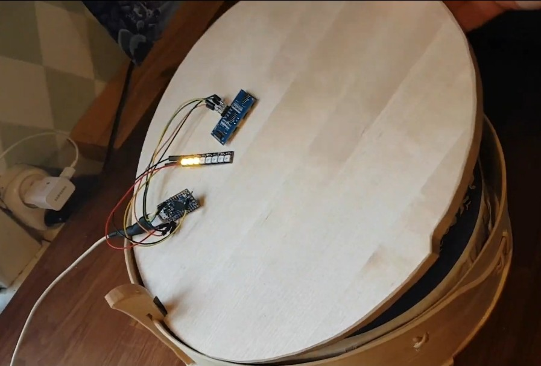

# knackedetector
So you just made or otherwise procured a traditional steam-bent pine box, and stocked it up with knäckebröd. Good job, now you have no idea how many discs of bread are left because you also put the lid on.
Deprived of calories from all that carving and baking, your brain glosses over the idea to drill a hole in the lid and just inserting a stick with one marking per bread thickness.

So, this is an Arduino sketch to sense the bread level using a SR04 ultrasonic distance sensor and display it using NeoPixels.

