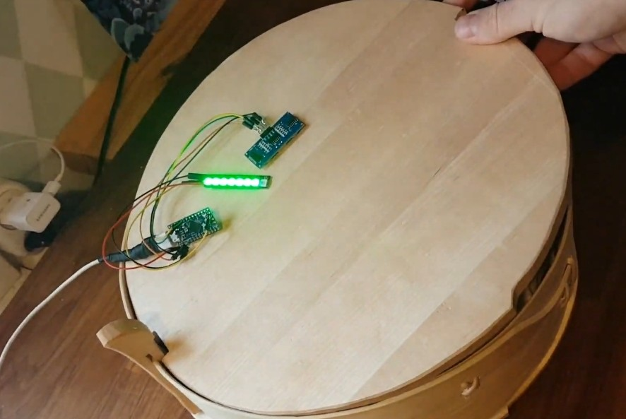

# knackedetector
So you just made or otherwise procured a traditional steam-bent pine box, and stocked it up with knäckebröd. Good job, now you have no idea how many discs of bread are left because you also put the lid on.
Deprived of calories from all that carving and baking, your brain glosses over the idea to drill a hole in the lid and just inserting a stick with one marking per bread thickness.

So, this is an Arduino sketch to sense the bread level using a [SR04 ultrasonic distance sensor][sr04] and display it using [NeoPixels][stick].

Ultrasound is not really reliable at really close ranges, like inside a full bread box, but with a small workaround in code by taking the median of a bunch of measurents it works ok (thx [@archevel](https://github.com/archevel)). This could be improved by using a [laser Time of Flight][laser] sensor, or even a LIDAR if you desire a more expensive bread box with even higher power draw.

[stick]:http://adafruit.com/products/1426
[sr04]:https://www.adafruit.com/product/3942
[laser]:https://www.adafruit.com/product/3317

